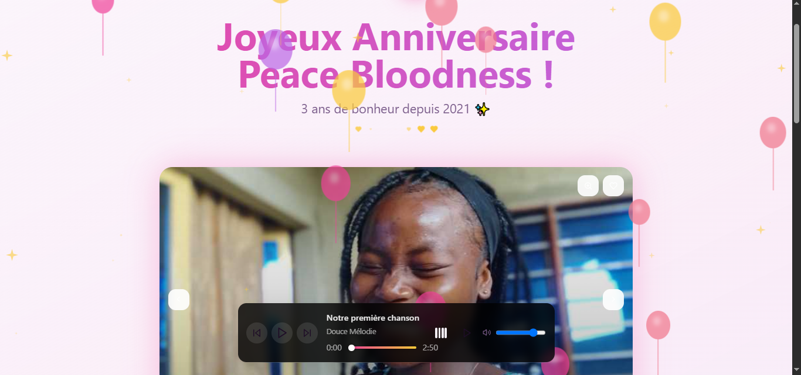
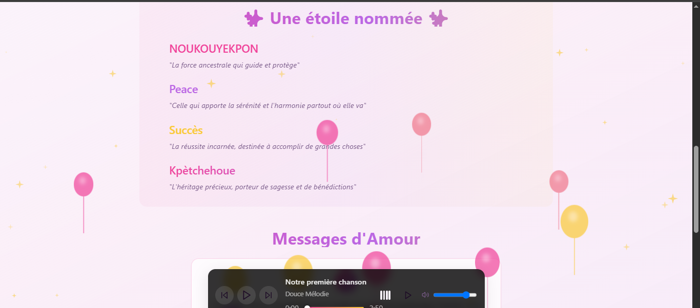
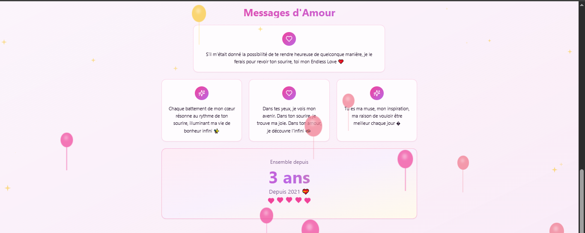

# 🎉 Peace Bloodness Birthday Celebration

Une application web interactive et émotionnelle créée pour célébrer l'anniversaire de Peace Bloodness, utilisant les technologies modernes pour offrir une expérience unique et mémorable.

## ✨ Aperçu



Cette application est un cadeau d'anniversaire numérique qui combine :
- 🎵 Un lecteur de musique personnalisé
- 🎨 Des animations élégantes
- 💝 Des messages personnalisés
- 📸 Un carrousel de photos souvenirs
- 🎊 Des effets visuels (confettis, étincelles)

## 🚀 Caractéristiques

### 🎵 Lecteur Musical Personnalisé

- Design moderne et responsive
- Playlist personnalisée de nos moments
- Contrôles de lecture intuitifs
- Visualisation audio élégante

### 💫 Animations et Effets
- Confettis animés pour l'ambiance festive
- Étincelles interactives
- Transitions fluides et élégantes
- Effets de parallaxe subtils

### 💝 Messages Personnalisés

- Présentation unique du nom NOUKOUYEKPON Peace Succès Kpètchehoue
- Messages d'amour animés
- Typographie élégante avec effets de dégradé
- Animations d'apparition séquentielles

## 🛠 Technologies Utilisées

- ⚛️ **React** - Framework Frontend
- 🎨 **TailwindCSS** - Styling
- 🔧 **TypeScript** - Type Safety
- ⚡ **Vite** - Build Tool
- 📦 **Shadcn/ui** - Composants UI
- 🎭 **Framer Motion** - Animations
- 🎵 **Howler.js** - Audio Management

## 🎯 Objectifs du Projet

1. Créer une expérience interactive et émotionnelle
2. Célébrer notre histoire à travers la musique et les photos
3. Exprimer des sentiments de manière créative et technologique
4. Offrir une interface utilisateur intuitive et responsive

## 💻 Installation et Utilisation

```bash
# Cloner le dépôt
git clone https://github.com/T0b0i7/peace-bloodness-hbd.git

# Installer les dépendances
cd peace-bloodness-hbd
npm install

# Lancer l'application en développement
npm run dev

# Build pour la production
npm run build
```

## 🌟 Fonctionnalités Spéciales

- **Mode Responsive** : Expérience optimisée sur tous les appareils
- **Mode Sombre/Clair** : Interface adaptative selon les préférences
- **Animations Performantes** : Optimisées pour la fluidité
- **Accessibilité** : Navigation au clavier et lecteur d'écran
- **SEO Optimisé** : Méta-tags et structure sémantique

## ❤️ Crédit

Développé avec amour par [T0b0i7](https://github.com/T0b0i7) pour Peace Bloodness.

## 📜 Licence

Ce projet est un cadeau personnel et n'est pas destiné à être réutilisé sans permission.

---

🌟 *"S'il m'était donné la possibilité de te rendre heureuse de quelconque manière, je le ferais pour revoir ton sourire, toi mon Endless Love"* 🌟
